# np-aig-assign

As part of Assignment 1 of the Artificial Intelligence for Games (AIG) module, we were tasked
to develop the game AI of the characters in HAL, a tower defense game.

This repository contains:
- The Game AI built as part of the assignment and our modifications to HAL.
- A copy of the HAL game's modified source code. (Rights belong to the author, Dr Oon Wee Chong).
- Accompanying report that details the work done in this assignment (below).

### Team
Thanks to the folks that contributed to this project &amp; the character they were responsible for:

| **Student Name**  | **Character** |
|-------------------|----------------|
| [Ana Katrina Dolor](https://github.com/idlefrenchfry) | Knight        |
| [Zhu Zhanyan](https://github.com/mrzzy)  | Archer        |
| [Joel Tio Jin Hon](https://github.com/joeltio)  | Wizard        |

# Report

**Assignment 1 Report**
# Table of Contents

**[Table of Contents](#table-of-contents) 2**

**[Overview of Team Strategy](#overview-of-team-strategy) 3**

> [Analysis on Character Stats](#analysis-on-character-stats) 5
>
> [Analysis on Upgrading Stats](#analysis-on-upgrading-stats) 7

**[Individual Hero Strategies](#individual-hero-strategies) 10**

> [Knight](#knight) 10
>
> [Overall approach](#overall-approach) 10
>
> [Fleeing (and healing)](#fleeing-and-healing) 10
>
> [Approach to leveling up](#approach-to-leveling-up) 10
>
> [How to decide on a target to
> attack](#how-to-decide-on-a-target-to-attack) 11
>
> [State machine diagram](#state-machine-diagram) 11
>
> [Archer](#archer) 11
>
> [Wizard - Joel](#wizard---joel) 12
>
> [Overall Approach](#overall-approach-1) 12
>
> [State Machine Diagram](#state-machine-diagram-1) 13
>
> [Smart Dodging and Movement](#smart-dodging-and-movement) 13
>
> [Threat Types](#threat-types) 13
>
> [Threat Response](#threat-response) 14
>
> [Edge Avoidance](#edge-avoidance) 14
>
> [Obstacle Avoidance](#obstacle-avoidance) 15
>
> [Obstacle Avoidance - Detecting the wizard in the
> boundary](#obstacle-avoidance---detecting-the-wizard-in-the-boundary)
> 15
>
> [Obstacle Avoidance - Deciding which way to
> go](#obstacle-avoidance---deciding-which-way-to-go) 18
>
> [Predicting and Hitting Multiple
> Enemies](#predicting-and-hitting-multiple-enemies) 19
>
> [Predicting Movement](#predicting-movement) 19
>
> [Hitting Multiple Enemies](#hitting-multiple-enemies) 20
>
> [Hitting Multiple Towers](#hitting-multiple-towers) 21

# Overview of Team Strategy

## Evaluation (CI/CD)

The HAL game relies on the Python’s random number generator (RNG) for
many different tasks, such as Orc spawn distribution, path selection and
upgrades for the provided AI. Due to this random nature of the HAL game,
it's difficult to evaluate strategies by running the game once. It's
difficult to tell if the strategy provides a net positive impact on the
probability of winning the game, or if the changes in results are
instead a fluke of random chance. Finally it's difficult to tell if we
have done enough to consistently beat the provided Game AI in easy and
hard mode. As such, there is a need for the development of a reliable
evaluation method that can be used to confidently determine if a
strategy is sound and nets an improvement in game performance.

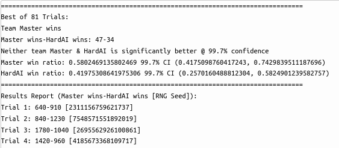

*Experiment Results Report*

To evaluate if a strategy is sound, we playtest the game AI with and
without the strategy. This makes the strategy our dependent variable
which we want to study the effect of while the rest of the game is kept
constant, except the RNG. In order to counter the effects of the RNG
causing random flukes, multiple trials of this playtest are run and the
results are averaged, dampening the effects of the RNG and giving a more
accurate result. A hypothesis test is done at some confidence to
determine if the strategy is significantly better, worse, or negligible
effect. At the end of the multiple trail experiment a human readable
results report is printed that gives the evaluation of the strategy from
the multi trial playtest. To catalog the experiment's results and
provide a point of comparison for future runs, the results are uploaded
to a MLFlow server where they can be compared.

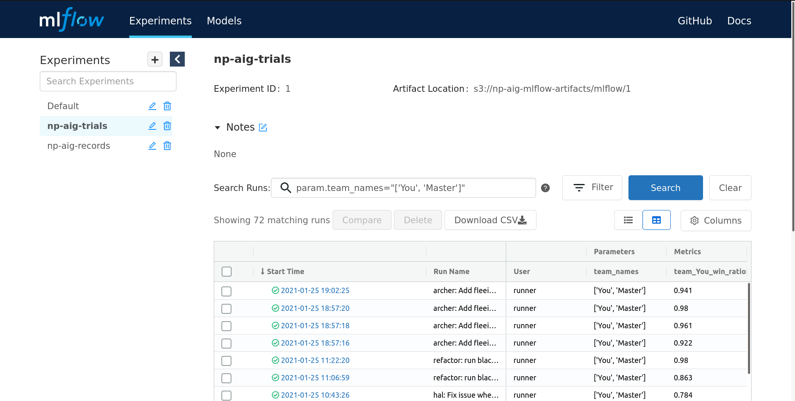

*Playtest Runs on MLFlow*

In practice to run multiple trails of the playtest, the game must first
be retrofitted to run in headless mode without a window. This is simple
enough done by configuring Pygame to run with a dummy graphics backend.
Next the game is augmented to allow the NPC AI files used in the game to
be configurable, which requires replacing the import statement with
Python’s importlib. Finally, in order to speed up the time spent on
running the playtests, multiprocessing is used to run the Playtests on
multiple cores, while a fast mode is added to the game to simulate 30FPS
at the fastest frame rate the CPU can run on, allowing the game to run
faster without disrupting the game’s outcomes. Since running playtests
is a chore, a Github Actions CI is developed to automatically run
playtests when a team member pushes a commit.

## Game Reproducibility

[**<u>https://github.com/mrzzy/np-aig-assign/pull/14</u>**](https://github.com/mrzzy/np-aig-assign/pull/14)

Another issue we faced was due to RNG used in the HAL game was
reproducibility of issues. During a game run, one may observe issues
with the strategy used, stuck as the character getting stuck on a wall.
However the RNG would ensure that the HAL game will be different next
run, where the issue may not appear at all, making issues hard to
reproduce, isolate and solve. To make HAL runs reproducible, we seed the
RNG so that it produces a predictable series of values. We also bind the
game to a constant frame rate to prevent nondeterminism due to variable
frame rates. This allows each HAL game to be reproduced locally by
checking out the same commit, seeding the RNG and binding the frame
rate. The multi trail playtest runner seeds the RNG with a random seed
for each trail of HAL it runs and records it down in the results report,
allowing us to reproduce failed trails from the mult trail playtest.

## Analysis on Character Stats

To better understand each character in the HAL and their attributes, we
inspected the codebase and collected and analyzed each of the
character’s stats:

| **Entity** | **HP** | **Attack Target**         | **Attack Type** | **Attack Stats**                                                                                          | **Movement**                                               |
|------------|--------|---------------------------|-----------------|-----------------------------------------------------------------------------------------------------------|------------------------------------------------------------|
| Base       | 1000   | Nearest within 220 radius | Projectile      | 40 damage @ 200 speed, 100 range, 3s cooldown (13.3 DPS)                                                  | \-                                                         |
| Tower      | 500    | Nearest within 160 radius | Projectile      | 30 damage at 200 speed, 3s cooldown (10 DPS)                                                              | \-                                                         |
| Mid Tower  | \-     | Nearest within 220 radius | Projectile      | 30 Damage @ 200 speed, 100 range, 3s cooldown (10 DPS)                                                    | \-                                                         |
| Knight     | 400    | \-                        | Melee           | 40 Damage 1.5s cooldown (26.6 DPS)                                                                        | Takes a random path along the graph towards the enemy base |
| Archer     | 200    | \-                        | Projectile      | 30 Damage @ 300 speed, 220 range 1s cooldown (30 DPS)                                                     | Takes a random path along the graph towards the enemy base |
| Wizard     | 150    | \-                        | Projectile      | 50 Damage @ 200 speed, 220 range, 2s cooldown (25 DPS), can do Splash Damage to multiple enemies at once. | Takes a random path along the graph towards the enemy base |
| Orc        | 100    | Nearest within 120 radius | Melee           | 20 Damage 2s cooldown (10 DPS)                                                                            | Takes a random path along the graph towards the enemy base |

Some interesting observations glean from the analysis include:

-   The Mid Towers is a neutral tower that always targets the nearest
    > entity regardless of team. Therefore it could be possible to avoid
    > taking damage from the mid-tower when attacking by taking a wider
    > route compared to the enemy.

-   The Knight has a large HP pool. SInce healing upgrades recover
    > health relative the characters health max health, healing upgrades
    > are more effective on characters such as knights.

-   Wizard and Archer have the come with sufficient range out of the box
    > to engage enemy towers without getting hit if they are far enough
    > away.

-   Although the Archer has the highest DPS, it can only engage one
    > person at a time. The Wizard can engage multiple targets at a time
    > using its splash damage, which deals damage to every enemy caught
    > within its projectile’s explosion radius.

## Analysis on Upgrading Stats

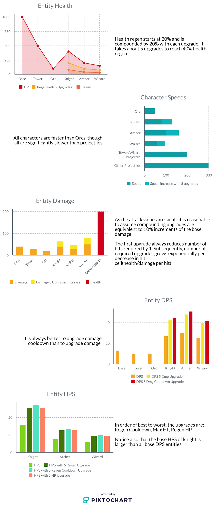


An interactive version of the infographic with the exact numbers can be
found at
[<u>https://create.piktochart.com/output/51766560-aig-character-stats</u>](https://create.piktochart.com/output/51766560-aig-character-stats).

Each statistic can be calculated by some variation of:

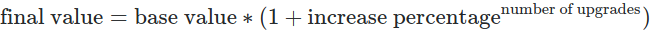

In summary, it is best to upgrade the health regen cooldown and attack
cooldown for health and damage respectively. By applying regen cooldown
only to knight, attack cooldown to archer and wizard, it is sufficient
to win Easy AI most of the time.

# Individual Hero Strategies

## Knight

### Overall approach

For this character, I focused more on how and when it should flee.
Enemies don’t tend to switch targets even if the target runs off. Thus,
I have coded it so that the character runs to around the base in order
to heal while fleeing. Since enemies don’t switch targets, I rely on the
base and towers to whittle down their health before I heal up enough to
kill the target I fled from. This sometimes also helps to bring enemies
away from defending their base.

### Fleeing (and healing)

In the fleeing state, the knight flees to around the base and one of the
corners of the path graph (top right or bottom left of game screen).
While fleeing, the character will heal.

Initially, fleeing was done every time the knight character went below
30%. While this was somewhat effective, I found that there were some
fights the knight could win but would run away because it’s health was
less than 30%. To remedy this, 2 functions were created, one to
calculate how long it would take the knight to kill its target
(time\_to\_kill), and the other to calculate how long it would take for
all the enemies to kill the knight (time\_to\_death). The
time\_to\_death function works under the assumption that at the time it
was called, all enemies' attack cooldown is at 0. Another function was
made to get a list of all the enemies that were currently targeting the
character, the output would be passed to the time\_to\_death function.

When entering the flee state, the state keeps track of the knight’s
target which it chose to flee from. If the knight recovers enough health
to kill its target before dying, it returns to attack state. If the
knight manages to reach 85% hp or there are no enemies targeting the
knight, then it will return to seeking state.

### Approach to leveling up

Based on the section analysing upgrading stats, I have chosen to have
the knight character focus on three different upgrades: healing
cooldown, speed, and melee cooldown.

Healing and melee cooldown upgrades are more effective than upgrading
healing percentage or melee damage. The reason I upgrade speed as well
is because this character relies heavily on both healing and running
from enemies in its flee state.

### How to decide on a target to attack

The knight character will attack based on the nearest opponent. With the
fleeing state, it is less likely to die even if it can’t kill the enemy
in one go. The time\_to\_kill function, which is one of the functions
used to determine whether the character can kill the enemy first, takes
into account the current healing cooldown.

### State machine diagram

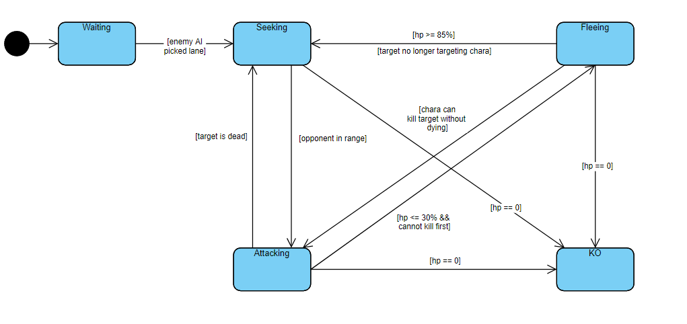

A fleeing state was added to the state diagram. To briefly summarize new
state changes, when the knight character is in attacking mode, it will
flee if it’s hp is low and return to attacking if it can kill its
target. In fleeing state, it will return to seeking if its hp is high
enough or there’s no one targeting the knight character.

## Archer

**Overall approach**

The Archer exhibits the highest DPS in the game out of the box, while it
also has a long projectile range. This makes the Archer devastating at
range, where it is able to deal its damage without significant
repercussions. The archer also moves the fastest out of the box. Overall
my approach is to focus on movement to always maintain a safe distance
from enemies both while attacking and fleeing from them. Upgrades are
focused on increasing the Archers DPS, although some are done to improve
the archer’s range, healing cooldown and movement speed.

**Approach to leveling up**

Choosing a stat to level is done by choosing a random stat from a
distribution of stats with different probabilities. The Archer has a 60%
projector upgrade to “range cooldown”, 10% chance of upgrading
“projectile range”, 10% chance of upgrading healing cooldown and finally
a 20% chance of upgrading “speed”. Projectile cooldown is heavily
focused on as directly increases the Archers DPS. It also allows the
Archers to shoot more projectiles to deal damage, ensuring that at least
some damage is done even when projectiles miss. The projectile range
upgrade is useful as it allows the archer to engage from a longer
distance, making it less dangerous to engage enemies as the distance
gives the archer a chance to retreat. Upgrading Healing cooldown reduces
the time spent in the fleeing state healing and allows it to return to
combat more quickly. As the archer moves fast out of the box and
movement speed upgrades relative, the boost from the movement speed
upgrade is most pronounced on the archer. The movement speed is also
important as it is used by the archer to move a safe distance away
during combat and fleeing.

**How to decide on a target to attack/Combat Strategy**

When choosing a target to attack, the Archer first engages any enemy
that has itself as their target. Since being set as target typically
means that the enemy is going to attack/is attacking us, it's a good
idea to try to finish off the attacker before it can finish us.
Otherwise the archer searches for the nearest opponent to attack
relative to the archer’s position. Special care needs to be taken to
ensure that the archer has line of sight to the enemy, otherwise an
opponent might be chosen that might appear to be using euclidean
distance but is actually on the other side of the obstacle and not
reachable. Line of sight detection is done by “shooting” a virtual “ray
of light” entity from the Archer to the target. If the “ray of light”
collides with an obstacle, we can infer that the Archer does not have
line of sight on the target.

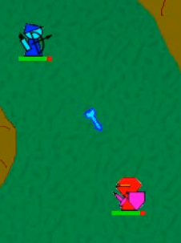

**Archer Attacking from a Safe Distance**

During combat the archer moves to try to maximize its distance from the
target, while staying close enough to shoot projectiles to attack the
target. The Archer seeks the target when the target is too far away,
while retreating towards the nearest graph node away from the target
when being chased by the target. This movement allows the archer to
attack from a safe distance , which allows the Archer to attack without
taking significant damage. When the target moves out of sight, the
Archers switch into a search state where it tries to follow the shortest
path to the target so as to regain line of sight with the target. If the
target moves to far away as defined as the shortest path distance from
the archer to the target, the Archer gives up searching and returns to a
seeking state.

These new movement tactics increase the chance that the Archer might
move to a position outside its seeking state path graph, such that when
it later reverts to seeking state, it becomes stuck as it tries to see a
point on the path graph through an obstacle as the path finding does not
take graph of the entire map into account. As such the path graph is
replaced with the full graph and a starting point. First a starting
point defines the initial path chosen by the Archer, replacing the path
selection role of the path graph. Since pathfinding is now calculated on
the entire graph, it can calculate a path for seeking, from any of the
math’s possible paths, irregardless of which path was chosen initially.

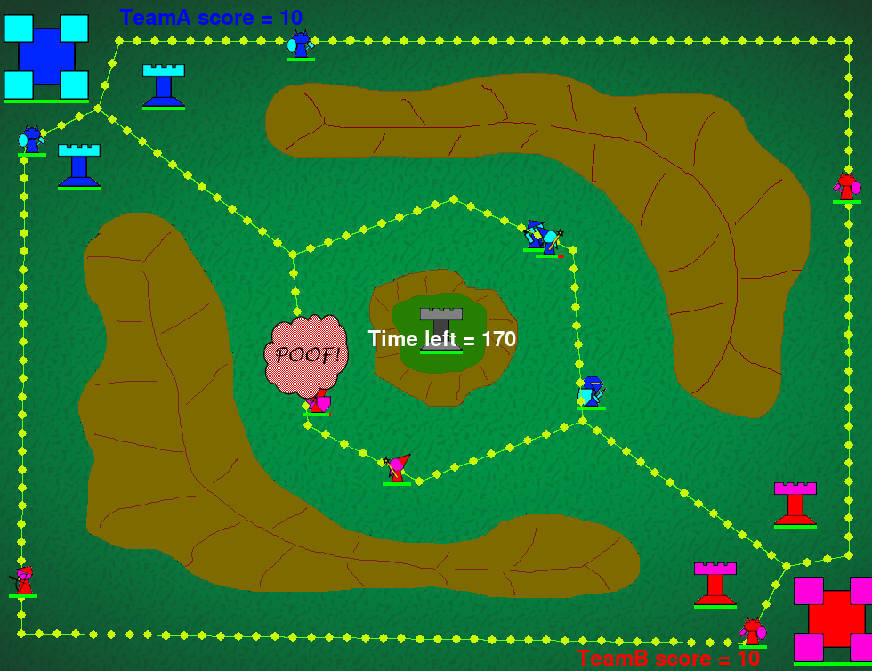

**Interpolated Graph**

When transitioning to the seeking state the Archer can be observed to
revert to the nearest graph node, except in a sparse graph is not very
close and as a result a Archer losing movement progress. To solve this
issue, graph nodes are interpolated between each graph connection at
each offset distance, turning into a dense set of connected nodes. Using
this interpolated graph, the Archer only has to revert a negligible
distance to reach the nearest graph node, ensuring that movement
progress is not lost.

Attacking at a distance has a significant downside. Since the
projectiles have to travel a longer distance, missing becomes a larger
issue. To improve accuracy at range, the archer tries to project the
target's velocity, trying to determine with heuristics whether the
target is attacking, seeking or stuck and calculating the corresponding
velocity. Using the projected velocity, the archer tries to project the
position of the target when the projectile hits the target and attacks
at this position. These heuristics allow Archer to consistently hit
moving targets that don’t change direction between frames.

**Use of healing, if applicable**

Healing is always done during seeking when HP is below max health.
During seeking, there are no enemies within its target range allowing
healing to be done with relatively little risk. Healing is also done
during search state when the HP is equal or below 75% max health, since
the Archer might be expected to restart combat as soon as line of sight
is achieved while searching, making healing riskier than during seeking.
Finally healing is done consistently to try to recover HP as fast as
possible in order to exit the fleeing state. Using Joel’s avoidance
code, the fleeing state dodges projectiles and immediate threats,
increasing the chance of survival.

**State machine diagram**

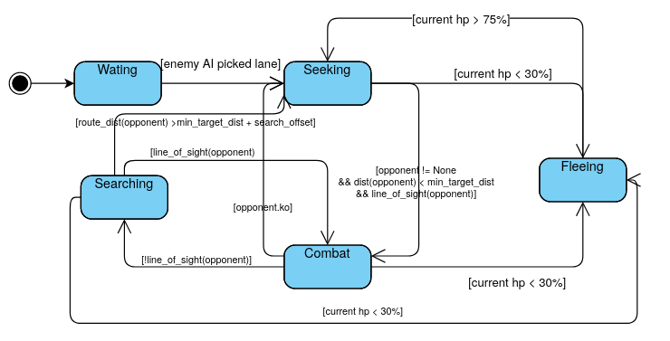

## Wizard - Joel

### Overall Approach

I have decided to focus on personal defence for the Wizard. As the
Wizard has very little health but has a lot of damage, it is important
to retreat at the right time and recover health.

Hence, I have focused on writing code to flee and recover. One new state
is introduced, the fleeing state. The fleeing state will be when the
wizard actively avoids battles and characters. It will also dodge
projectiles.

In terms of levelling up, only the attack cooldown is upgraded. This is
because the health upgrades do not provide significant advantage. Every
health upgrade allows the Wizard to sustain about 1 more hit:

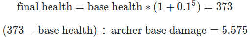

Furthermore, the upgrades are less useful since the upgrades based on
the wizard’s base health, which is low. Hence, it is more useful to
upgrade damage attributes.

As discussed in the team strategy section, the best upgrade for damage
is the attack cooldown. Hence, only the attack cooldown is upgraded.

### State Machine Diagram

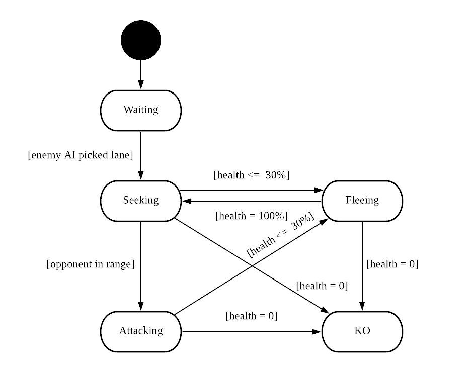

There has not been much change to the state machine diagram. A new
“fleeing” state has been added. The Wizard will enter the fleeing state
when its health is below 30% of its maximum health.

When the Wizard is in the fleeing state, it will actively move away from
all hostile are potentially hostile entities, prioritising immediate
threats (e.g. projectiles, melee characters in very close proximity). To
do so, it uses the threat response described in the [<u>Smart Dodging
and Movement</u>](#smart-dodging-and-movement) section. While dodging,
it may get stuck at obstacles or edges, so the Wizard also uses the
obstacle and edge avoidance techniques described in the same section.

While fleeing, the Wizard will heal itself until it has reached full
health. It will transition into the seeking state when its healing
cooldown is 0 and it has reached full health.

The main change to attacking is hitting multiple enemies, as described
in the [<u>Predicting and Hitting Multiple
Enemies</u>](#predicting-and-hitting-multiple-enemies) section.

### Smart Dodging and Movement

#### Threat Types

There are two kinds of threats that the wizard dodges: immediate threats
and other

threats. Immediate threats are entities which may damage the wizard
immediately. For example, projectiles and nearby melee enemies. On the
other hand, other threats are any entity which can damage the wizard
entity.

When fleeing because of low health, it is a good idea to dodge both
types of threats. However, when moving towards a target to attack, it is
a good idea to only dodge immediate threats.

#### Threat Response

The wizard will dodge entities with a constant velocity (e.g.
projectiles) by moving to the perpendicular of the projectile.
Furthermore, if there are multiple projectiles, it will find each
projectile’s perpendicular and perform vector addition:

*Example of avoiding multiple threats by adding perpendicular vectors*

For other threats, the wizard will just move away from the threat.

These two techniques are combined using weighted vector addition. Since
the immediate threats are more important, they are assigned a weight to
increase their significance in the final velocity.

#### Edge Avoidance

As the wizard is dodging an obstacle, it may be cornered into an edge.
The entity will then be stuck at the edge. This is not ideal. Ideally,
the wizard will continue moving along the edge.

The direction to move along the edge can be calculated by projecting the
current desired movement vector onto specific edge vectors:

*Projection of vector on edge vector*

Projection is not required, however, it is a much cleaner approach. A
method without projection will need to check which way the current
wizard is moving, and scale the vector accordingly.

#### Obstacle Avoidance

It is common that when the wizard is fleeing, it will run into an
obstacle such as a mountain or the plateau. The wizard will be stuck on
the obstacle and die. To fix this issue, the wizard needs to move along
the edges of the obstacle. Furthermore, for smoother movement, the
wizard needs to move along a wider boundary. By making the boundary
wider, smaller changes along the obstacle edge will be smoothened.

There are two main problems to solve:

-   How do I know when the wizard is within the boundary?

-   Where should the wizard move when it is within the boundary?

#### Obstacle Avoidance - Detecting the wizard in the boundary

Firstly, to find if the wizard is within the boundary, points are marked
around the edges of the obstacle. As pygame does not provide points
along the image boundary, these points have to be manually created.

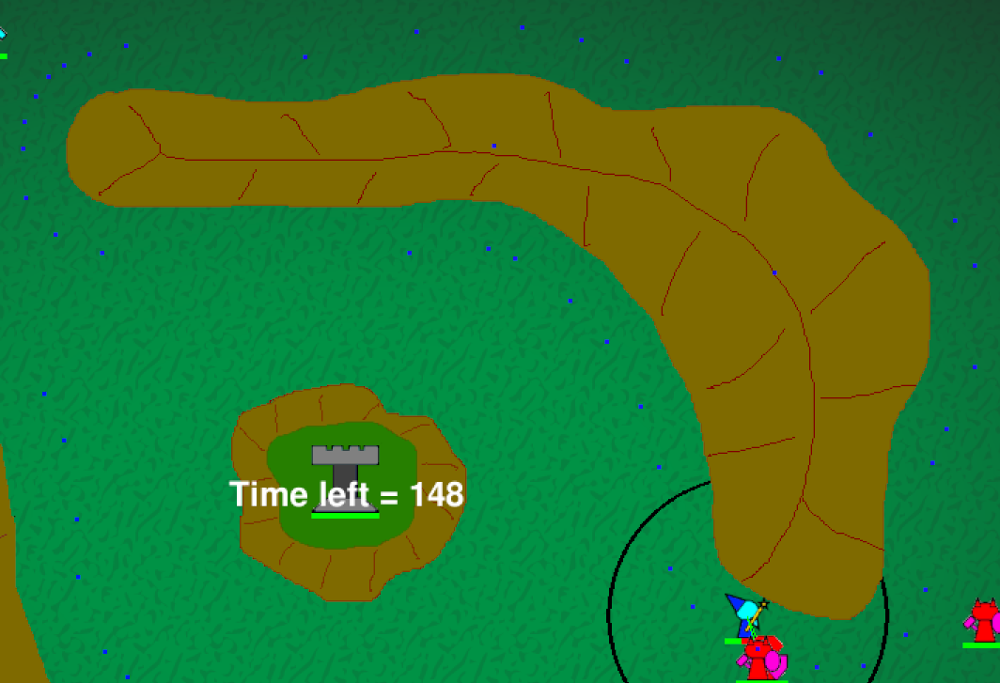

*Blue points mark where the points are*

These points are stored in a text file and loaded into the game. Note
that the points are stored in order, clockwise.

Typically, to detect if a point is within a polygon, we will need to
draw a line from the point to a known point inside the polygon, then
check the number of intersections. If the number of intersections is
even, then the point is outside the polygon. However, this is not easily
done. Each edge must be tested, which may make it computationally
infeasible for every frame.

Alternatively, mask collision can be used to detect if the wizard is
within the boundary.

However, to save on computational cost and time, I have created a
different method which is sufficient for this. The idea is that since
the points are in clockwise order, we know that “inside” is on the right
of the edge. We can determine if the wizard is within the boundary by
using two vectors:

1.  Wizard’s position to foot of perpendicular of the edge

2.  Edge’s direction vector rotated 90 degrees to the right

By finding the dot product of the first and second vector, we can
determine if the wizard is within the boundary. If the dot product is
positive, then the wizard is outside the boundary. If it is negative, it
is within the boundary.

*Boundary detection using foot of perpendicular and right vector*

This solution does not work in general, as the points closest points may
not be representative of the closest boundary:

*Example of polygon where boundary detection will not work*

#### Obstacle Avoidance - Deciding which way to go

Once the character is known to be within the boundary, that is when the
character will start to steer away from the boundary. To do so, the
direction vector is changed based on how far away the character is from
the boundary. The further the character is, the more the direction
vector will point towards the boundary.

This effect can be achieved by weighting the desired direction and the
“corrective” vector based on a ratio of distance from boundary to
maximum distance to boundary:

```python
# Move towards the path based on how far the entity is from path
# The further the entity is from the path, the more the bias is ignored
foot_bias_ratio = (min(closest_edge["distance"], MAX_DISTANCE)) / MAX_DISTANCE
vec = (closest_edge["foot"] - avoider.position).normalize() * foot_bias_ratio
vec += biased_dir.normalize() * (1 - foot_bias_ratio)
return vec
```

### Predicting and Hitting Multiple Enemies

To hit multiple enemies accurately, the Wizard needs to predict where
each enemy is moving towards, then calculate the optimal location for
hitting multiple enemies. Finding the optimal solution is
computationally infeasible, hence, an approximation is calculated.

More details will be discussed after discussing how predicting movement
is done.

#### Predicting Movement

To predict the movement of a character that is moving in a constant
direction, it is trivial. The velocity multiplied by the time will give
the displacement.

However, to predict the movement of a character chasing another
character, the problem becomes extremely hard to solve. This is because
the movement of the chaser is not linear anymore. Prediction becomes
infeasible as predicting will mean stepping through the next hundred few
frames to predict the location.

To predict the exact location, we will need to solve the following
system of differential equations:

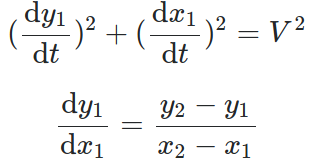

*System of differential equations which determine movement of chaser*

Where (x<sub>1</sub>, y<sub>1</sub>) is the chaser’s location,
(x<sub>2</sub>, y<sub>2</sub>) is the location of the entity being
chased and V is the max speed of the chaser.

It is also to be noted that solving these equations will result in the
ideal position, while the game will give only an approximation. Hence,
not only is it impossible to solve these equations with our current
knowledge, the result is also not representative of the actual resulting
position.

#### Hitting Multiple Enemies

The algorithm to hit multiple enemies approximates by:

1.  Find where to shoot projectile such that it hits one target exactly

2.  Repeat for all targets in range and line of sight

3.  Remove outlier target points

4.  Average target points

Firstly, to find where to shoot a projectile to hit a target exactly,
the ratio between the target’s velocity and the projectile speed is
calculated. This is important as this tells us the ratio between the
vector lengths to the intersection. Then, using the sine rule, we can
solve for the sides as well as the angles to the intersection. Visually:

In the example, since the ratio between the velocities is 2:1, we then
know that the ratio of side A to side B is 2:1 as well. Using this
knowledge, the value of angle A and side C, we can solve using the sine
rule:

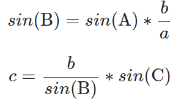

*Key equations derived from the sine rule*

Secondly, by performing this operation on all the potential targets, we
now know where the targets are likely to be hit at.

Thirdly, we remove outliers. This is done by calculating the standard
deviation of the x and y values of the points. Then, pick the value with
a higher standard deviation and remove the first and fourth quartiles.
This is only done if the standard deviation is higher than a certain
threshold.

Lastly, with the remaining points, we find the average point and set our
target there. These points should be a good approximation of the optimal
solution.

#### Hitting Multiple Towers

In addition to hitting multiple enemies, a special check is made for
towers. If the wizard is targeting a tower, it will move slightly closer
and hit a sweet spot where the explosion hits all three towers:

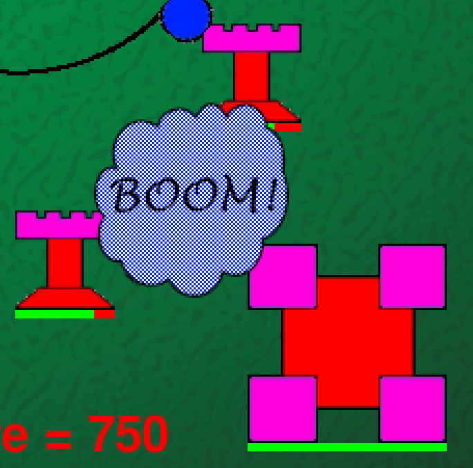

*Wizard’s explosion radius colliding with all three towers*
